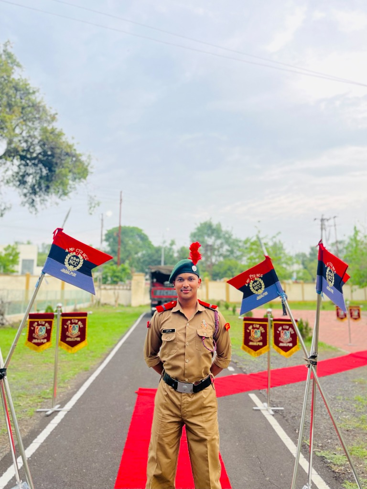

# Parv Jain - Modern Portfolio Website

A sleek, responsive, modern developer portfolio website built with pure **HTML5, CSS3, and modern JavaScript (ES6+)**.



## 🚀 Key Highlights & Sections

- **Hero & Identity**: Features Parv's uploaded professional portrait with glowing animated borders, live typewriter subtitle effect, quick contact chips, and immediate CTAs.
- **Key Metrics / Achievements Ticker**: Highlights TCS Ninja placement, BSNL 5G-IoT training, 4+ Cisco & AWS certifications, and NCC A/B/C credentials.
- **About Me**: Academic background at *Gyan Ganga Institute of Science & Technology* (B.Tech in IoT, Cybersecurity & Blockchain 2023–2027) and core engineering mindset.
- **Technical Skills Matrix**: Comprehensive categorization covering Programming Languages (C++, Python, DSA, SQL), Front-End Development, IoT & Cybersecurity (5G, Protocols), Machine Learning & Vision (OpenCV, EAR), and Tools (Git, GitHub, VS Code, Linux).
- **Industry Training**: Detailed experience at *BRBRAITT – BSNL* (5G-IoT Device Integration Program).
- **Featured Projects**:
  - **Drowsiness Detection System (2024)**: Computer vision & ML system using OpenCV and the Eye Aspect Ratio (EAR) algorithm.
  - **API Integration Web Application (2024)**: Responsive front-end web app using Fetch API / async-await with 20% optimized response speed.
  - Project filter tabs and interactive architecture modal dialogs.
- **Certifications & Honors**:
  - Placed in TCS (Ninja Profile)
  - AWS Certified AI Practitioner
  - Cisco Networking Academy: Cyber Security Essentials, Introduction to Cyber Security, Networking Basics
  - National Cadet Corps (NCC): Completed A, B, and C Certificates.
- **Interactive Contact**: One-click clipboard copy for email and phone, direct mailto/tel links, and responsive message form.
- **Resume Preview**: Dedicated modal and printable view of the curriculum vitae.
- **Dark / Light Theme Toggle**: Persistent theme switcher with custom-tuned color tokens and subtle particle canvas background.

## 📂 Project Structure

```
excited-lavoisier/
├── index.html          # Semantic HTML5 markup and section architecture
├── style.css           # Modern CSS variables, glassmorphism, responsive grid, themes
├── script.js           # Typewriter effect, theme switcher, canvas particles, filters, modals
├── assets/
│   ├── profile.jpg     # Professional portrait photo
│   └── resume_preview.png # Resume visual preview
└── README.md           # Documentation and setup instructions
```

## 💻 How to View & Run Locally

### Option 1: Direct Browser Launch
Simply double click `index.html` in your file explorer or right-click and choose **Open with > Chrome / Edge / Firefox**.

### Option 2: Local HTTP Server (Python)
Run the following command in the project directory:
```powershell
python -m http.server 3000
```
Then open your browser and navigate to:
```
http://localhost:3000
```

### Option 3: VS Code Live Server
Right-click `index.html` and select **"Open with Live Server"**.

## 🌐 Deploy to GitHub Pages (Free)
1. Push this repository to GitHub.
2. Go to **Settings > Pages**.
3. Under **Branch**, select `main` (or `master`) and folder `/ (root)`.
4. Click **Save** — your site will be live at `https://<username>.github.io/<repo-name>/`.

